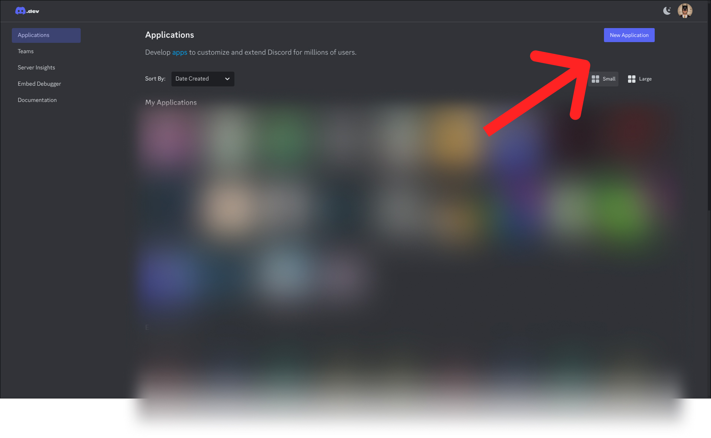
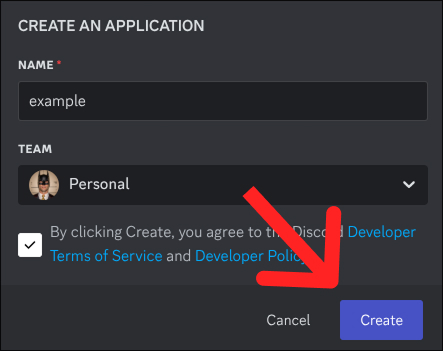
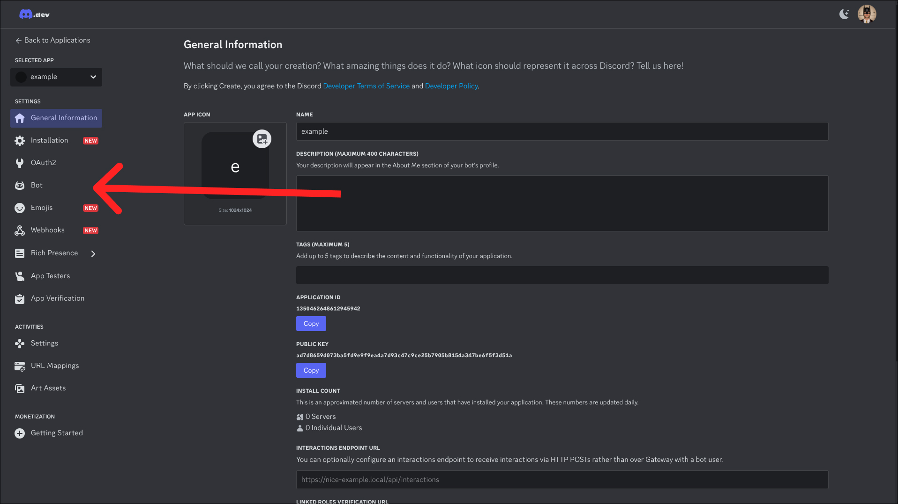
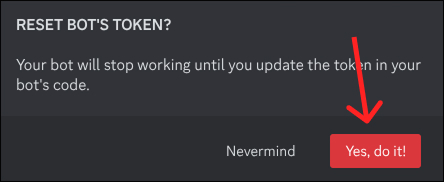
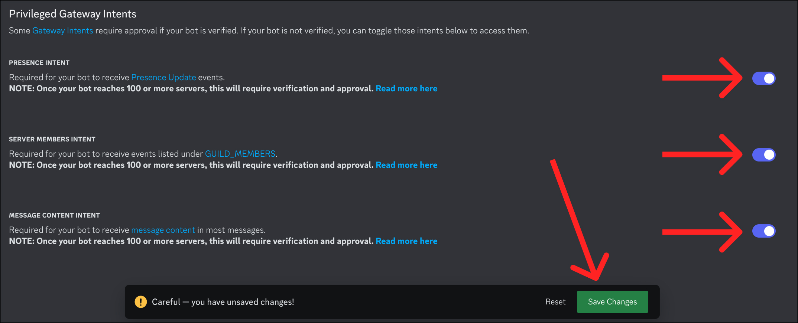

# Discord Reaction Role Bot


## About

> 🔥 The bot has been fully rewritten in Rust! 🔥
> _(check out [Migrating](#migrating-from-the-python-version))_

This is a easy to use Discord bot with human friendly configuration files.

### Features

- Emoij Reaction Roles (also works with custom emoji's)
- Experience/Leveling system with leaderboard
- Token configurable from env (also loads .env) or config file
- Reaction logging
- Chat and slash command support (configurable)
- Configurable rich presence
- Configurable verbose logging

## Getting started

### Discord setup

#### Creating a bot and finding your token

Go to the [Discord Developer Portal](https://discord.com/developers/applications).
Click on `New Application` and give your bot a name.




Then you should be redirected to the application page. Click on `Bot` in the sidebar.


Great, now we are on the page where we can manage our bot; on this page you can
change the username, avatar and banner of your bot. You can also set your bot to
be private (recommended but not required).

In order for Reaction-Role to run on your bot we need the token, initially no
token will be known, so we need to reset it. This token is very important and
should be kept secret. If you ever think your token has been compromised, or you
have lost it, you can just reset it here.


Copy the token and save it somewhere safe (we will need this for the configuration)

Our last step is to ensure the bot has the correct Discord intents enabled.
We can just do this by scrolling down in the bot page and enable all intents.
(or the ones that apply) Remember to save your changes.


### Configuring the bot

Setting up the bot is easy, in the config directory you will find
`*.example.yaml` files. Make sure to copy each of these files to a new file
without the `.example` extension.

#### About the config files

- `./config/config.yaml` - Contains all bot configuration
- `./config/lang.yaml` - Contains all language strings (this is what the bot
  sends for messages)

#### Bot Authentication

The bot requires a token to authenticate with Discord.
(see [Creating a bot and finding your token](#creating-a-bot-and-finding-your-token))

There are two ways to provide the bot with the token, either through an
environment variable or through the config file.

If you don't know what an environment variable is, you can just use it in the
config file and set `token_env_enabled` to false.

```yaml
token_env_enabled: false
token: "XXXYOURBOTTOKENHEREXXX"
```

If you want to use environment variables, you can set the `token_env_enabled` to
true and set the key of the environment variable in the `token_env` field.
`.env` files will also be loaded automatically.

#### Configuring the reaction roles

In the config, you will find a key called `reaction_roles`. This key contains a
listing of messages that it will watch for reactions.

On each message you can define several emoji's and their role (id) that should
be given if someone reacts to it using that emoji.

For custom emoij's use the emoij id.

#### How to obtain a message and role id?

In your Discord client, enable developer mode _(settings -> advanced)_. Now go
to the message that you want to use and right click on the message. You should
see a new option called `Copy ID`. This will copy the message id to your
clipboard. Which you can then paste in the config file.

For role id's, you can do the same but on the role in the server settings or on
a user profile.

### Running the bot (Docker)

Now that you have your bot token, you can use the provided docker compose file
to easily get your bot up and running.

In the project directory _(where the `docker-compose.yml` file is located)_, run
the following command:

```bash
docker compose up
```

If you have just pulled an updated version of the bot, you might want to rebuild
the image:

```bash
docker compose up --build
```

#### Running in the background

To run the bot in the background, you can use the `-d` flag:

```bash
docker compose up -d
```

### Running from source

This bot is written in Rust, so you will need to have Rust installed on your
system. OpenSSL is also required for the bot to work. If you are using the
Nix package manager, you can load the `flake.nix` file.

Once all dependencies are installed, you can run the bot with the following

```bash
cargo run --release
```

## Migrating from the Python version

**BEFORE MIGRATING, MAKE SURE TO TURN OFF THE BOT AND BACKUP YOUR `db` FOLDER IF
PRESENT!**

The only change required is in the config.
Make the `.py` and `.cfg` files to the expected YAML format.
All data will keep working.

### Why moving to Rust?

Rust provides a more stable development environment and is just my preferred
language. As an added bonus, it's faster and more efficient than Python.

### Why moving to YAML?

The YAML format is language independent and is easier to read and write.
This change allows for more flexibility in the configuration and for a
potentional future where the bot is rewritten in another language.

## Having issues?

Please [create an issue](https://github.com/Arthurdw/Reaction-Role/issues/new)
or join [our discord](https://dc.arthurdw.com) and I'll help you out!

## Support this project

If you like this work, you can support me by buying me a coffee!
[paypal.me/ArthurDeWitte](http://paypal.me/ArthurDeWitte)

### Special thanks

Special thanks to `combatmedic02` for supporting me in this project ♥
